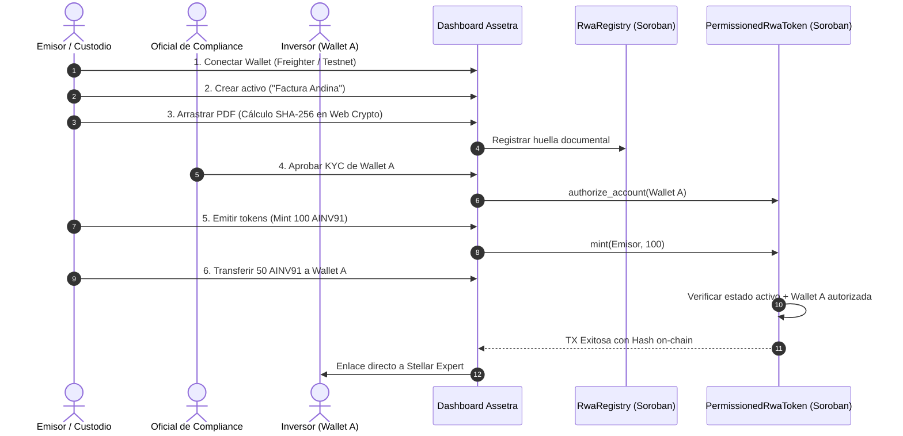

# Guion Oficial de Demostración y Casos de Uso — Assetra RWA

Este documento contiene el guion integral para presentar, evaluar y verificar la infraestructura **Assetra** en Stellar Testnet. Abarca desde el **flujo ideal (*Happy Path*)** hasta **todos los casos de fallo y reglas de compliance on-chain**, tanto en la plataforma Web interactiva como en la suite automatizada CLI.

---

## 1. Resumen Ejecutivo de la Arquitectura

Assetra es una infraestructura modular para la tokenización de Activos del Mundo Real (RWA) sobre Stellar, compuesta por:
- **`RwaRegistry` (Smart Contract Soroban)**: Almacena metadatos del activo, identificador único, estado del ciclo de vida (`draft`, `active`, `paused`, `redeemed`) y la huella criptográfica SHA-256 de los documentos de respaldo.
- **`PermissionedRwaToken` (Smart Contract Soroban)**: Token con control de acceso estricto donde cada transferencia evalúa en tiempo real si el receptor y el emisor están autorizados por el Oficial de Compliance.
- **Dashboard Web (Frontend React 19 + TypeScript + Freighter)**: Interfaz con soporte de conmutación híbrida (Modo Mock / Modo Live API), cálculo de huellas PDF en cliente y feedback visual inmediato de rechazos on-chain.
- **API REST (Node / Express + SDK)**: Servicio que expone endpoints estandarizados para consultar activos, registrar identidades, ejecutar transferencias y consultar el estado on-chain.

### Despliegue en Stellar Testnet
- **Network**: Testnet (`Test SDF Network ; September 2015`)
- **RPC URL**: `https://soroban-testnet.stellar.org`
- **RwaRegistry**: [`CAC57CATCF5DZYLRW6XEZ4DP367V25D24KO6V37U4EEQWJO3CTVV7N5F`](https://stellar.expert/explorer/testnet/contract/CAC57CATCF5DZYLRW6XEZ4DP367V25D24KO6V37U4EEQWJO3CTVV7N5F)
- **PermissionedRwaToken**: [`CBACUWCFDNO7BU7UCI7G4U45Y5WDNXCAGVI4AFQO5ZBMBHMRFC67GLKG`](https://stellar.expert/explorer/testnet/contract/CBACUWCFDNO7BU7UCI7G4U45Y5WDNXCAGVI4AFQO5ZBMBHMRFC67GLKG)

---

## 2. Preparación del Entorno

Para ejecutar la demostración completa con frontend y backend conectados:

```bash
# 1. Instalar dependencias
npm install

# 2. Iniciar entorno fullstack (Frontend en :5173 y Backend en :4000)
npm run dev
```

Abre en tu navegador: `http://localhost:5173/`

---

## 3. FASE 1: El Flujo Ideal (Happy Path)

Este flujo demuestra el ciclo de vida completo y exitoso de un activo permissioned respaldado por documentos reales.



### Paso a Paso en la Interfaz:

1. **Conectar Wallet**:
   - En la esquina superior derecha, haz clic en **"Conectar Freighter"**.
   - Si tienes la extensión instalada, autoriza la conexión. Si no la tienes, el sistema activa automáticamente la cuenta demo Testnet (`GB72...BOI4`).
   - Se muestra la píldora verde de cuenta activa.

2. **Crear o Seleccionar Activo**:
   - Navega a **"ACTIVOS"** y selecciona el activo principal: `Factura Andina 091` (`AINV91`).
   - Nota el Contract ID registrado, el suministro máximo (1,000) y los tokens emitidos (625).

3. **Registro y Verificación Documental (Web Crypto API)**:
   - Navega a la pestaña **"DOCUMENTOS"**.
   - Arrastra cualquier archivo PDF al área de carga (*dropzone*).
   - Observa que el navegador calcula de forma 100% local el hash SHA-256 (sin subir el PDF a servidores externos, garantizando privacidad de datos comerciales).
   - Haz clic en **"Registrar huella"**. El documento queda indexado con su hash inmutable.

4. **Onboarding y Autorización de Compliance**:
   - Navega a **"PARTICIPANTES"**.
   - Observa a los participantes registrados con sus respectivos estados.
   - Si registras un nuevo participante, inicia en estado `PENDIENTE`.
   - Como Oficial de Compliance, haz clic en **"Autorizar"** junto a la cuenta (ej. `Aya Capital (Wallet A)`).
   - El estado cambia inmediatamente a `AUTORIZADO`.

5. **Emisión de Tokens (*Mint*)**:
   - Regresa a **"ACTIVOS"** > panel de controles administrativos.
   - Ingresa una cantidad (ej. `100`) y haz clic en **"Mint"**.
   - El suministro emitido se incrementa y queda registrado en el historial de actividad.

6. **Transferencia Permissioned Exitosa**:
   - En el panel **"Transferencia de Tokens RWA (Permissioned Transfer)"**:
     - **Cuenta Origen**: Cuenta emisora o wallet conectada.
     - **Destinatario**: Selecciona el botón rápido `Aya Capital (Autorizado)`.
     - **Cantidad**: `50`.
     - Haz clic en **"Transferir"**.
   - **Resultado Esperado**:
     - Se despliega el **banner verde de confirmación**.
     - Se muestra el hash de la transacción y el enlace directo:  
       `Ver TX en Stellar Expert (https://stellar.expert/explorer/testnet/tx/...)`.
     - El evento queda archivado en la lista de actividad reciente del activo.

---

## 4. FASE 2: Catálogo de Casos de Fallo y Reglas de Compliance

En esta fase se someten a prueba todas las salvaguardas y mecanismos de seguridad implementados tanto en los contratos Soroban como en la API y el frontend.

### Caso 2.1: Transferencia a Cuenta Desconocida / No Registrada
- **Escenario**: Un participante intenta enviar tokens a una dirección externa aleatoria que nunca ha pasado por el proceso de identificación KYC/AML.
- **Acción**: En el panel de transferencia, haz clic en el botón de prueba rápida **"Wallet No Registrada"** (o escribe una dirección no autorizada como `GDESCONOCIDA999NOAUTORIZADAXASSETRA`). Haz clic en **"Transferir"**.
- **Resultado On-Chain / API**:
  - Código de error: `ReceiverNotAuthorized`.
  - HTTP Status: `400 Bad Request`.
  - Mensaje: *"La transacción fue bloqueada por el contrato de reglas de Assetra porque la dirección de destino no está autorizada por Compliance (no registrada en Whitelist)"*.
- **Comportamiento en UI**:
  - Se despliega un banner rojo con el distintivo **`[RECHAZO DE REGLA ON-CHAIN]`**.
  - Se incluye un botón directo **"Gestionar Whitelist en Participantes"** para invitar al oficial a revisar la cuenta.

### Caso 2.2: Transferencia a Cuenta con KYC Pendiente
- **Escenario**: Un usuario inició el registro pero su documentación aún no ha sido revisada ni aprobada por Compliance.
- **Acción**: En destinatario, selecciona `Norte (Pendiente)`. Haz clic en **"Transferir"**.
- **Resultado Esperado**:
  - Reversión inmediata con código `ReceiverNotAuthorized`.
  - Nota de estado: `(estado actual: 'PENDING')`.
  - Los fondos permanecen en la cuenta emisora; ningún token sale del balance.

### Caso 2.3: Transferencia a Cuenta Congelada Cautelarmente
- **Escenario**: Una cuenta fue congelada preventivamente por orden judicial o sospecha de fraude.
- **Acción**: En destinatario, selecciona `Frost (Congelado)`. Haz clic en **"Transferir"**.
- **Resultado Esperado**:
  - Reversión de la transacción. El contrato Soroban impide que cuentas congeladas reciban nuevos fondos mientras dure la investigación.
  - Alerta roja destacando `ERROR: ReceiverNotAuthorized (estado actual: 'FROZEN')`.

### Caso 2.4: Transferencia Originada por Cuenta Congelada
- **Escenario**: El titular de una cuenta congelada intenta liquidar o enviar sus fondos antes de una resolución legal.
- **Acción**: En el campo Cuenta Origen, coloca la dirección de `Frost Liquidator` (`GFRZ8899...`) e intenta transferir.
- **Resultado Esperado**:
  - Reversión con código `WalletFrozen`.
  - Mensaje: *"La cuenta emisora se encuentra congelada preventivamente por Compliance"*.
  - Demuestra el cumplimiento de normativas de inmovilización de fondos (OFAC / UIF).

### Caso 2.5: Transferencia Originada por Cuenta Revocada
- **Escenario**: Una entidad cuya autorización fue retirada definitivamente intenta mover tokens.
- **Acción**: En Cuenta Origen, ingresa la wallet de `Revoked Global` (`GREV1122...`) y envía hacia una cuenta autorizada.
- **Resultado Esperado**:
  - Reversión con código `SenderNotAuthorized`.
  - La transacción es abortada inmediatamente.

### Caso 2.6: Operaciones sobre Activo Pausado o Redimido
- **Escenario**: El emisor detecta una anomalía en el mercado o el activo entra en liquidación, por lo que el contrato es pausado.
- **Acción**:
  1. En controles administrativos, haz clic en **"Pausar"**. El estado del activo cambia a `PAUSADO`.
  2. Intenta hacer clic en **"Mint"** o realizar una transferencia.
- **Resultado Esperado**:
  - El botón de transferir queda deshabilitado en la UI.
  - Si se invoca vía API o directamente al contrato, revierte con: `AssetNotActive: No se pueden transferir ni emitir tokens porque el activo está en estado 'paused'`.
  - Al hacer clic en **"Reactivar"**, el activo vuelve a `ACTIVO` y las transferencias se restablecen.

### Caso 2.7: Emisión Superior al Suministro Máximo (*Cap Enforcement*)
- **Escenario**: El emisor intenta emitir más tokens del valor auditado o respaldado por las facturas.
- **Acción**: Ingresa una cantidad de emisión de `10,000` (cuando el suministro disponible es menor a 400).
- **Resultado Esperado**:
  - El sistema bloquea la acción con: `INVALID_MINT_AMOUNT: El monto supera el suministro máximo disponible`.
  - Previene inflación no respaldada de activos.

### Caso 2.8: Quema de Tokens Superior al Balance (*Overburn Protection*)
- **Escenario**: Intento erróneo de quemar más tokens de los que existen en circulación.
- **Acción**: Intentar ejecutar la acción `Burn` con un monto superior al `mintedSupply`.
- **Resultado Esperado**:
  - Error: `INVALID_BURN_AMOUNT: El monto supera el balance emitido`.

### Caso 2.9: Alteración de Documentos y Detección de Fraude
- **Escenario**: Una contraparte intenta presentar una factura adulterada con montos modificados.
- **Acción**:
  1. Arrastra el PDF original a la pestaña Documentos y toma nota de su SHA-256 registrado (`a47f8c0d...`).
  2. Arrastra un PDF con una sola cifra editada.
- **Resultado Esperado**:
  - El hash SHA-256 resultante es completamente diferente (efecto avalancha).
  - Al comparar contra la huella registrada on-chain en el contrato `RwaRegistry`, la inconsistencia queda en evidencia de manera matemática e inmutable.

### Caso 2.10: Intento de Gestión de Whitelist por Cuenta No Autorizada
- **Escenario**: Un participante común intenta auto-autorizarse o autorizar a un tercero en la lista de compliance.
- **Acción**: Invocar la función `authorize_account` en Soroban usando una firma que no sea la del Oficial de Compliance (`GBRLOUSTR76GIMHAMQGKLO4EBJEALCB5R2OVZ4RQGOGV7LNCIBNTALAX`).
- **Resultado Esperado**:
  - El contrato Soroban revierte la transacción exigiendo `require_auth()` del Oficial de Compliance configurado en la inicialización.

---

## 5. FASE 3: Demostración Automatizada en Testnet (Script CLI)

Para presentar la evidencia técnica on-chain sin interacción web, ejecuta el script de demostración que corre directamente contra los Smart Contracts desplegados en Stellar Testnet:

```bash
npm run script:demo
```

### Qué ejecuta el script paso a paso:
1. **Paso 1**: Lee el estado del activo en `RwaRegistry` (Nombre, Custodio, Huella documental).
2. **Paso 2**: Verifica la autorización de `Wallet A` en `PermissionedRwaToken`.
3. **Paso 3**: Emite tokens RWA hacia la cuenta emisora en Testnet.
4. **Paso 4**: Ejecuta la transferencia exitosa hacia `Wallet A` (Autorizada) y muestra el hash de la transacción on-chain.
5. **Paso 5**: Intenta transferir hacia `Wallet B` (No autorizada) y **demuestra la reversión forzada on-chain** con código de error de Soroban.
6. **Paso 6**: Congela cautelarmente una cuenta y verifica la inmovilización de fondos.

---

## 6. Matriz Resumen de Estados y Reglas de Compliance

| Estado Participante | ¿Puede Recibir Tokens? | ¿Puede Enviar Tokens? | Acción Permitida por Compliance |
|---|---|---|---|
| **Pendiente** (`pending`) |  No (`ReceiverNotAuthorized`) |  No (`SenderNotAuthorized`) | `[Autorizar]` / `[Rechazar]` |
| **Autorizado** (`authorized`) |  **Sí** |  **Sí** | `[Congelar]` / `[Revocar]` |
| **Congelado** (`frozen`) |  No (`ReceiverNotAuthorized`) |  No (`WalletFrozen`) | `[Descongelar]` / `[Revocar]` |
| **Revocado** (`revoked`) |  No (`ReceiverNotAuthorized`) |  No (`SenderNotAuthorized`) | `[Re-autorizar]` |

---

## 7. Conmutación Híbrida: Modo Mock vs. Live API

En la barra de navegación superior encontrarás el botón de modo:
- **`MODO: MOCK`**: Ejecución en memoria dentro del navegador, ideal para presentaciones sin conexión o demos rápidas.
- **`API LIVE (4000)`**: Comunicación HTTP REST con el backend Express en el puerto 4000, permitiendo interactuar con los servicios y contratos de Stellar.
- Al hacer clic sobre el botón, el dashboard valida la salud de la API (`GET /health`) y alterna transparentemente de modo sin recargar la página.
