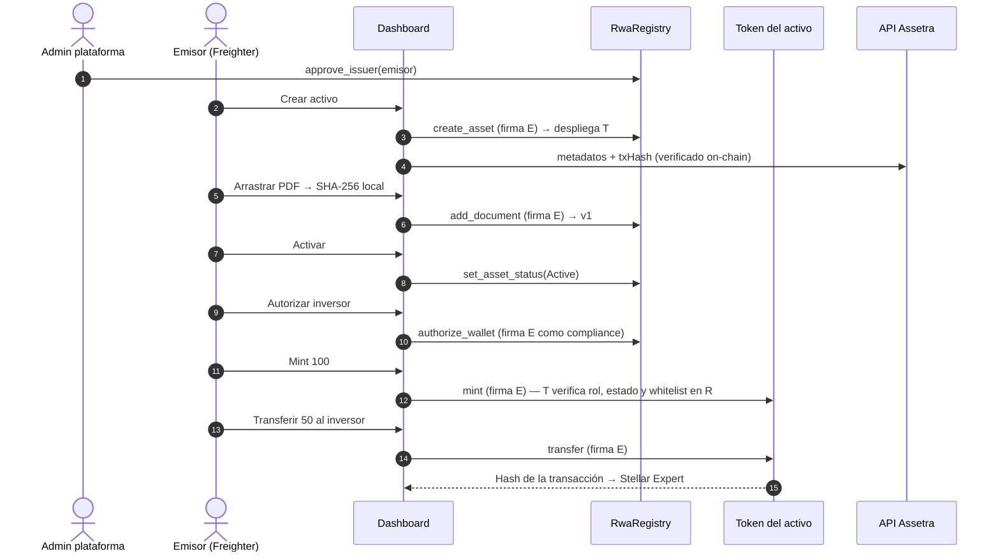

# Guion de Demostración — Assetra RWA

Guion para presentar y verificar Assetra en Stellar Testnet: el **flujo ideal** de un emisor, el **catálogo de casos de fallo** que aplican los contratos y la **demostración automatizada** por línea de comandos.

---

## 1. Qué se demuestra

| Pieza | Rol en la demo |
|---|---|
| **`RwaRegistry`** | Emisores aprobados, registro del activo, documentos (SHA-256), estado del activo y whitelist. Despliega un token por activo. |
| **Token del activo** (`PermissionedRwaToken`) | Mint, transferencias y redención. En cada operación consulta roles, estado y whitelist en el registro. |
| **Dashboard** (React + Freighter) | Cada acción la **firma el usuario** con Freighter. |
| **API** (Express) | No tiene claves: guarda metadatos y solo acepta escrituras respaldadas por una transacción verificada on-chain. |

**Despliegue actual (Testnet):**
- `RwaRegistry`: [`CBA2NU2QACTD5GGYIXAQXBDJTGUZDTLJ7RVU6JUHPHWTNL46JOKLHJPN`](https://stellar.expert/explorer/testnet/contract/CBA2NU2QACTD5GGYIXAQXBDJTGUZDTLJ7RVU6JUHPHWTNL46JOKLHJPN)
- Activo de referencia `FACT001` — token [`CCIA5TNHXLMCQ6N34VVZAZBXKBEXIWFKUE4SWSFU2GWTL2AE6BPLACKR`](https://stellar.expert/explorer/testnet/contract/CCIA5TNHXLMCQ6N34VVZAZBXKBEXIWFKUE4SWSFU2GWTL2AE6BPLACKR)
- Wallet B (nunca autorizada, útil para los rechazos): `GDEO2AIPR5JXLSVHYUMKXZGSB74H353VH7XKOGECUYQPFIT2QV66VIPJ`

---

## 2. Preparación

### Opción A — Demo on-chain (recomendada)

```bash
cp backend/.env.example backend/.env       # ASSETRA_MODE=live
cp frontend/.env.example frontend/.env     # VITE_ASSETRA_CLIENT=http
npm install
npm run dev
```

1. Instala [Freighter](https://www.freighter.app/), selecciona **Testnet** y prepara dos cuentas fondeadas con [Friendbot](https://laboratory.stellar.org/#account-creator?network=test):
   - **Cuenta Emisor**: la que creará el activo.
   - **Cuenta Inversor**: la que recibirá tokens (solo hace falta para los casos 4.4 y 4.5).
2. Aprueba la cuenta Emisor (lo hace el admin de la plataforma):
   ```bash
   npm run script:issuer -- approve G...CUENTA_EMISOR
   ```
3. Abre <http://localhost:5173>, pulsa el botón de modo hasta ver **API LIVE** y conecta Freighter con la cuenta Emisor.

### Opción B — Demo sin wallet (simulación)

`npm run dev` con la configuración por defecto (**MODO: MOCK**). Todo ocurre en el navegador con datos ficticios, incluidos participantes de ejemplo en cada estado (`Norte` pendiente, `Frost` congelado, `Revoked` revocado). Sirve para presentar sin conexión, pero **no** genera transacciones reales.

---

## 3. Fase 1 — Flujo ideal (on-chain)



Cada paso abre Freighter para firmar; muestra al público la ventana de firma.

1. **Crear activo** — *Crear activo*: nombre, símbolo (letras, números o `_`, de 2 a 12 caracteres), tipo, valor, **suministro máximo** (p. ej. 1000) y responsables → **Crear activo**.
   - Resultado: activo en **Borrador** con *Contract ID* propio (su token). Tu wallet queda como emisor y oficial de compliance.
2. **Documentos** — pestaña *Documentos*: arrastra un PDF. El SHA-256 se calcula en el navegador y el archivo **no se sube a ningún servidor**. **Registrar huella** → la versión la asigna el contrato (v1, v2…).
3. **Activar** — *Activos* → **Activar** (Borrador → Activo).
4. **Participantes** — *Participantes*: nombre, wallet de la cuenta Inversor y jurisdicción → **Autorizar participante**. Registrar un participante lo autoriza en la whitelist on-chain.
5. **Mint** — *Activos* → cantidad `100` → **Mint**. Si tu propia wallet aún no estaba en la whitelist, se firma primero su autorización (dos firmas).
6. **Transferir** — destino: el botón rápido del inversor, cantidad `50` → **Transferir**.
   - Resultado: banner verde con el hash y el enlace a Stellar Expert. El evento aparece en *Actividad reciente* con su hash.

---

## 4. Fase 2 — Catálogo de casos de fallo

Todos los rechazos se producen **en el contrato** (la simulación previa a la firma ya los detecta, así que no se paga comisión). El dashboard muestra el código de error on-chain.

| # | Caso | Cómo provocarlo (modo on-chain) | Resultado esperado |
|---|---|---|---|
| 4.1 | Emisor no aprobado | Conecta en Freighter una cuenta **no aprobada** e intenta crear un activo | `IssuerNotApproved` (registro #7) |
| 4.2 | Emisión en borrador | Crea un activo y pulsa **Mint** antes de **Activar** | `AssetNotActive` (token #6) |
| 4.3 | Destino no autorizado | Transfiere a Wallet B (`GDEO2AIP…VIPJ`) | `ReceiverNotAuthorized` (token #1); saldos intactos |
| 4.4 | Destino congelado | *Participantes* → **Congelar** al inversor → transfiérele | `WalletFrozen` (token #3) |
| 4.5 | Origen congelado o revocado | Con el inversor congelado o revocado, conecta su cuenta en Freighter e intenta transferir | `WalletFrozen` (#3) / `SenderNotAuthorized` (#2) |
| 4.6 | Activo pausado | **Pausar** → transfiere o emite → **Reactivar** | `AssetPaused` (token #4) |
| 4.7 | Emisión por encima del máximo | Mint de una cantidad que supere el suministro máximo restante | `MaxSupplyExceeded` (token #10) |
| 4.8 | Quema superior al saldo | **Burn** de más tokens de los que tienes | `InsufficientBalance` (token #5) |
| 4.9 | Emisor revocado | Admin: `npm run script:issuer -- revoke G...` → el emisor intenta **Mint** | `IssuerNotApproved` (token #11). Restablece con `approve` |
| 4.10 | Gestión de whitelist ajena | Conecta una cuenta que no es compliance del activo e intenta autorizar o congelar | `Unauthorized` (registro #3) |
| 4.11 | Documento adulterado | Arrastra el PDF original y luego una copia con una cifra cambiada | Los SHA-256 difieren por completo; la huella on-chain no coincide con la copia |
| 4.12 | Escritura falsa en la API | `curl -X POST localhost:4000/api/assets/asset-fact001/actions -H "Content-Type: application/json" -d '{"action":"pause"}'` | `TX_PROOF_REQUIRED`. Con un `txHash` inventado: `TX_NOT_CONFIRMED` |
| 4.13 | Redención | **Redimir** → intenta transferir o emitir | `AssetNotActive` (#6). Los titulares aún pueden **Burn** |

> En **modo simulación** los casos 4.3 a 4.5 se muestran con los participantes de ejemplo (`Frost`, `Revoked`, `Norte`) y el botón *Wallet No Registrada*.

---

## 5. Fase 3 — Demostración automatizada (CLI)

Evidencia on-chain sin interfaz. Requiere Stellar CLI con las identidades `admin`, `issuer`, `compliance`, `wallet_a` y `wallet_b` (las crea `npm run script:seed`).

```bash
npm run script:demo
```

Cada ejecución crea **su propio activo** (`DEMOxxxxxx`) y no modifica `FACT001`. Ejecuta 11 pasos y verifica 40 resultados; termina con código de error si alguno no coincide.

| Paso | Qué demuestra |
|---|---|
| 1 | Una cuenta no aprobada no puede crear activos (#7); el admin aprueba al emisor |
| 2 | El emisor registra el activo y se despliega su token con `max_supply`; mint en borrador rechazado (#6) |
| 3 | Documentos con versión automática; un tercero no puede añadirlos (#3) |
| 4 | Activación y transición inválida Active → Draft (#4) |
| 5 | Whitelist por compliance; una cuenta no puede autorizarse sola (#3) |
| 6 | Mint hasta el máximo y rechazo por encima (#10) |
| 7 | Transferencia válida, monto 0 (#9) y destino no autorizado (#1) |
| 8 | Congelamiento: no puede recibir ni enviar (#3) |
| 9 | El admin pausa (#4 en transferencias), pero no puede reactivar (#3) |
| 10 | Emisor revocado no puede emitir (#11) |
| 11 | Redención: transferencias y mint rechazados (#6); los titulares queman sus tokens |

---

## 6. Matriz de estados de una wallet

| Estado | ¿Recibe tokens? | ¿Envía tokens? | Acciones de compliance |
|---|---|---|---|
| **Pendiente** (sin registro) | No — `ReceiverNotAuthorized` | No — `SenderNotAuthorized` | Autorizar |
| **Autorizado** | **Sí** | **Sí** | Congelar / Revocar |
| **Congelado** | No — `WalletFrozen` | No — `WalletFrozen` (tampoco puede quemar) | Descongelar (re-autorizar) / Revocar |
| **Revocado** | No — `ReceiverNotAuthorized` | No — `SenderNotAuthorized` | Re-autorizar |

## 7. Estados del activo

| Estado | Mint | Transfer | Burn | Transiciones |
|---|---|---|---|---|
| **Borrador** | No (#6) | No (#6) | No | → Activo |
| **Activo** | Sí | Sí | Sí | → Pausado, → Redimido |
| **Pausado** | No (#4) | No (#4) | No (#4) | → Activo, → Redimido |
| **Redimido** | No (#6) | No (#6) | **Sí** | Terminal |
