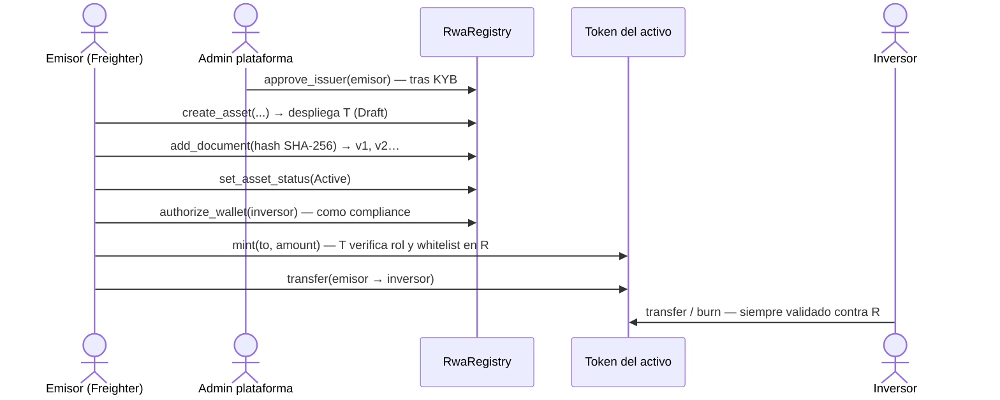
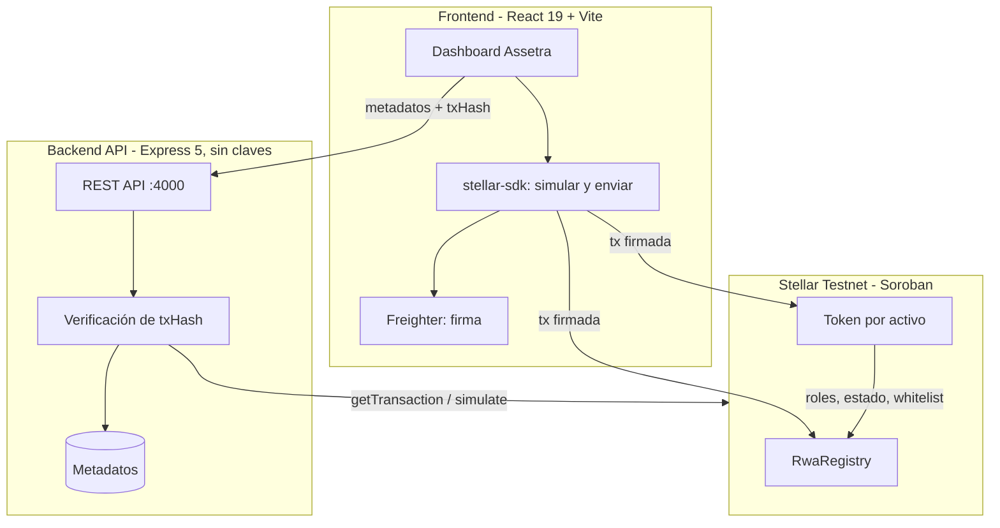

<p align="center">
  
</p>

# Assetra — Infraestructura RWA sobre Stellar

> Infraestructura modular para registrar, emitir y administrar activos del mundo real (RWA) con reglas de cumplimiento verificables on-chain sobre **Stellar Testnet** (Soroban).

[](https://stellar.expert/explorer/testnet)
[](https://developers.stellar.org/docs/build/smart-contracts/overview)
[](https://react.dev/)

> [!WARNING]
> **Proyecto de demostración / hackathon. No usar en Mainnet ni con fondos reales.**
> Revisa [Seguridad y limitaciones](#10-seguridad-y-limitaciones) antes de exponerlo públicamente.

---

## Índice

1. [Visión general](#1-visión-general)
2. [Cómo funciona: roles y flujo](#2-cómo-funciona-roles-y-flujo)
3. [Contratos desplegados en Testnet](#3-contratos-desplegados-en-stellar-testnet)
4. [Arquitectura](#4-arquitectura)
5. [Inicio rápido](#5-inicio-rápido)
6. [Configuración](#6-configuración)
7. [Comandos disponibles](#7-comandos-disponibles)
8. [API REST](#8-api-rest)
9. [Estructura del repositorio](#9-estructura-del-repositorio)
10. [Seguridad y limitaciones](#10-seguridad-y-limitaciones)
11. [Solución de problemas](#11-solución-de-problemas)

---

## 1. Visión general

Assetra permite a emisores aprobados tokenizar activos del mundo real (facturas, bonos, inmuebles) con reglas de cumplimiento que se aplican **en el propio contrato**:

- **Un token por activo**: al registrar un activo, `RwaRegistry` despliega su `PermissionedRwaToken` en la misma transacción, con un suministro máximo fijo.
- **Emisores aprobados**: solo wallets aprobadas por el administrador de la plataforma (tras su KYB) pueden registrar activos.
- **Whitelist por activo**: `mint` y `transfer` solo hacia/desde wallets autorizadas por el oficial de compliance del activo (diseño *fail-closed*). Se pueden congelar o revocar wallets.
- **Documentos verificables**: la huella SHA-256 de cada documento queda registrada on-chain con versión inmutable; el archivo nunca sale del navegador.
- **Autocustodia**: cada operación la firma el usuario con **Freighter**. El backend no tiene claves.

---

## 2. Cómo funciona: roles y flujo

### Roles

| Rol | Quién es | Qué puede hacer |
|---|---|---|
| **Admin de la plataforma** | Cuenta que despliega `RwaRegistry` | Aprobar/revocar emisores, pausar cualquier activo (freno de emergencia), rotar admin |
| **Emisor** | Wallet aprobada por el admin | Registrar activos, subir documentos, activar/pausar/redimir, **emitir (mint)** |
| **Oficial de compliance** | Designado al crear el activo (por defecto, el propio emisor) | Autorizar, revocar y congelar wallets del activo |
| **Inversor / titular** | Wallet autorizada en la whitelist | Recibir, transferir y quemar (redimir) tokens |

El token **no tiene admin propio**: lee los roles y el estado del activo desde `RwaRegistry`, que es la única fuente de verdad. Si el admin revoca a un emisor, este deja de poder emitir de inmediato.

### Flujo de un emisor



1. **Conectar wallet** (Freighter, red Testnet).
2. **Aprobación**: el admin aprueba la wallet como emisor: `npm run script:issuer -- approve G...`.
3. **Crear activo**: el emisor firma `create_asset`; queda en *Borrador* con su token desplegado.
4. **Documentación**: se calcula el SHA-256 del PDF en el navegador y el emisor firma `add_document`.
5. **Activar** el activo (*Borrador → Activo*).
6. **Participantes**: el oficial de compliance autoriza las wallets de los inversores.
7. **Mint**: el emisor emite tokens hacia wallets autorizadas, hasta el suministro máximo.
8. **Transferir**: cada titular transfiere desde su propia wallet; el contrato rechaza destinos no autorizados o congelados.
9. **Redención**: el activo pasa a *Redimido* y los titulares queman sus tokens.

---

## 3. Contratos desplegados en Stellar Testnet

| Contrato | ID | Explorador |
|---|---|---|
| **RwaRegistry** (registro + factory) | `CBA2NU2QACTD5GGYIXAQXBDJTGUZDTLJ7RVU6JUHPHWTNL46JOKLHJPN` | [Stellar Expert](https://stellar.expert/explorer/testnet/contract/CBA2NU2QACTD5GGYIXAQXBDJTGUZDTLJ7RVU6JUHPHWTNL46JOKLHJPN) |
| **Token de `FACT001`** | `CCIA5TNHXLMCQ6N34VVZAZBXKBEXIWFKUE4SWSFU2GWTL2AE6BPLACKR` | [Stellar Expert](https://stellar.expert/explorer/testnet/contract/CCIA5TNHXLMCQ6N34VVZAZBXKBEXIWFKUE4SWSFU2GWTL2AE6BPLACKR) |
| WASM de tokens (hash) | `6e64793fc36948517f674d98b351395574f54348bf0d753735cc97ae39e75ddc` | — |

Desplegados el 2026-10-09. Cada activo nuevo obtiene su propio token (consulta su ID con `get_token`). Si vuelves a desplegar, `npm run script:deploy && npm run script:seed` actualizan `contracts.json` y `backend/contracts.json`; actualiza también esta tabla.

### Cuentas de prueba (direcciones públicas)

| Rol | Dirección |
|---|---|
| Admin | `GDYTRRED2LSGOVDHDAH7YGBFEIQKVMZAS6NYO3UMVGXLHRB5K5ERGUJ6` |
| Emisor (aprobado) | `GARJUK44OEGOLYWJMY6D7INVOXQZGNJGZ3JAXBQ367WYLLNO4TFBGZRF` |
| Oficial de Compliance de `FACT001` | `GALOPSCAIIIWS4725QQRQJKSH3PCGXXJMTL2EA4R5RORUOYBXFJWLKGB` |
| Inversor A (autorizado) | `GAYP4UFK4UFAGCEX3H53AGXDTQPMTLB5XMKTPWOSVTCJO5XYQZDEGT7F` |
| Inversor B (no autorizado) | `GDEO2AIPR5JXLSVHYUMKXZGSB74H353VH7XKOGECUYQPFIT2QV66VIPJ` |

Detalle de funciones y códigos de error en [`contracts/README.md`](./contracts/README.md).

---

## 4. Arquitectura



- **El frontend firma**: arma la transacción, la simula, pide la firma a Freighter, la envía y espera la confirmación.
- **El backend verifica**: solo acepta una escritura si trae el `txHash` de una transacción exitosa, firmada por la cuenta con el rol correcto, sobre el contrato, función y activo esperados. Cada `txHash` se puede usar una sola vez. Saldos, estados y whitelist se leen siempre de la cadena.
- **Modo mock**: sin backend ni blockchain, todo se simula en el navegador (útil para demos sin wallet).

---

## 5. Inicio rápido

### Prerrequisitos

| Herramienta | Necesaria para |
|---|---|
| Node.js 20+ y npm 10+ | Frontend, backend y scripts |
| [Freighter](https://www.freighter.app/) en red Testnet | Firmar operaciones en modo on-chain |
| Rust + target `wasm32v1-none` | Compilar/testear contratos |
| [Stellar CLI](https://developers.stellar.org/docs/tools/cli) | Solo para el admin: deploy, seed, aprobar emisores |

### Modo 1 — Simulación en el navegador

```bash
npm install
npm run dev
```

Abre <http://localhost:5173>. Sin Freighter se conecta una wallet demo ficticia.

### Modo 2 — On-chain (Testnet)

```bash
cp backend/.env.example backend/.env       # cambia ASSETRA_MODE=live
cp frontend/.env.example frontend/.env     # cambia VITE_ASSETRA_CLIENT=http
npm install
npm run dev
```

1. En la interfaz, activa **API LIVE** y conecta Freighter (Testnet, cuenta fondeada con [Friendbot](https://laboratory.stellar.org/#account-creator?network=test)).
2. Pide al admin que apruebe tu wallet como emisor:
   ```bash
   npm run script:issuer -- approve G...TU_WALLET
   ```
3. Crea tu activo y sigue el [flujo](#flujo-de-un-emisor).

### Desplegar tus propios contratos (admin)

```bash
stellar keys generate admin --network testnet --fund
npm run script:deploy   # compila, sube el WASM del token y despliega RwaRegistry
npm run script:seed     # aprueba al emisor demo, crea FACT001, autoriza wallets y emite 1000 tokens
```

### Docker / Koyeb (backend)

```bash
docker compose up --build          # desde la raíz (contexto backend/)
```

- El backend **no necesita claves ni Stellar CLI**: la imagen final (`node:22-alpine`) solo contiene Node, las dependencias de producción y `contracts.json`; se eliminan `npm`, `npx` y `corepack`, y se ejecuta como usuario sin privilegios.
- Escaneo con Trivy (2026-10-09): **0 vulnerabilidades altas o críticas** (la imagen anterior basada en Debian tenía 4 críticas y 66 altas).
- `backend/contracts.json` es la copia que se empaqueta en la imagen; deploy y seed la mantienen sincronizada.
- Los metadatos de activos se guardan en `data/chain-assets.json`: en Koyeb usa un volumen persistente para no perderlos entre despliegues. Saldos, estados y whitelist siempre se reconstruyen desde la cadena.
- En Koyeb define `TRUST_PROXY=1` y `CORS_ORIGIN` con la URL del frontend.

---

## 6. Configuración

### Backend (`backend/.env`)

| Variable | Por defecto | Descripción |
|---|---|---|
| `PORT` | `4000` | Puerto de la API |
| `CORS_ORIGIN` | *(vacío)* | Orígenes permitidos separados por coma. **Defínelo en producción** |
| `ASSETRA_MODE` | `mock` | `mock` (simulación) o `live` (verificación on-chain) |
| `STELLAR_NETWORK` | `testnet` | Red |
| `STELLAR_RPC_URL` | `https://soroban-testnet.stellar.org` | RPC de Soroban |
| `STELLAR_NETWORK_PASSPHRASE` | `Test SDF Network ; September 2015` | Passphrase de la red |
| `RWA_REGISTRY_CONTRACT_ID` | valor de `contracts.json` | Override del registro (si está definido, tiene prioridad) |
| `RATE_LIMIT_PER_MINUTE` | `300` | Peticiones por minuto y por IP a `/api` (`0` desactiva) |
| `RATE_LIMIT_WRITES_PER_MINUTE` | `30` | Escrituras (POST/PATCH) por minuto y por IP (`0` desactiva) |
| `TRUST_PROXY` | `0` | Número de proxies delante de la API. **En Koyeb usa `1`**: si no, todos los usuarios comparten la IP del proxy y el límite los bloquea a la vez |

### Frontend (`frontend/.env`)

| Variable | Por defecto | Descripción |
|---|---|---|
| `VITE_ASSETRA_CLIENT` | `mock` | `mock` o `http` |
| `VITE_API_URL` | `http://localhost:4000` | URL base de la API |

---

## 7. Comandos disponibles

| Comando | Descripción |
|---|---|
| `npm run dev` | Frontend y backend en modo desarrollo |
| `npm run build` | Compila backend y frontend |
| `npm run test` | Tests de backend y frontend (Vitest) |
| `npm run test:contracts` | Compila el WASM del token y ejecuta los 18 tests de contratos |
| `npm run typecheck` | Chequeo de tipos de ambos workspaces |
| `npm run script:deploy` | Despliega `RwaRegistry` y sube el WASM de tokens a Testnet |
| `npm run script:seed` | Crea el activo demo `FACT001` y las cuentas de prueba |
| `npm run script:issuer -- <approve\|revoke\|status> G...` | Gestión de emisores aprobados (admin) |
| `npm run script:demo` | Demostración on-chain automatizada: crea su propio activo y verifica 40 resultados (no modifica `FACT001`) |

---

## 8. API REST

| Método | Ruta | Uso |
|---|---|---|
| GET | `/health` | Estado y modo de la API |
| GET | `/api/config` | Red y contrato `RwaRegistry` (modo live) |
| GET | `/api/assets` | Listar activos |
| GET | `/api/assets/:assetId` | Consultar un activo (sincroniza con la cadena; es también su `metadata_uri`) |
| POST | `/api/assets` | Registrar metadatos tras `create_asset` |
| POST | `/api/assets/:assetId/actions` | `activate`, `mint`, `burn`, `pause`, `unpause`, `redeem` |
| POST | `/api/assets/:assetId/transfers` | Registrar una transferencia |
| POST | `/api/assets/:assetId/participants` | Registrar un participante autorizado |
| PATCH | `/api/assets/:assetId/participants/:participantId` | Cambiar estado (`authorized`, `revoked`, `frozen`) |
| POST | `/api/assets/:assetId/documents` | Registrar documento (hash SHA-256) |

En modo live todas las escrituras requieren `txHash` (si falta: `TX_PROOF_REQUIRED`). Errores: `{ error, message, isComplianceRejection }`. Más detalle en [`backend/docs/API.md`](./backend/docs/API.md).

### Demostración

- **Guion para presentar**: [`DEMO_SCRIPT.md`](./DEMO_SCRIPT.md) — flujo ideal en el dashboard con Freighter y catálogo de 13 casos de fallo con su código on-chain.
- **Evidencia automatizada**: `npm run script:demo` — 11 pasos contra Testnet; termina con error si algún resultado no es el esperado.

---

## 9. Estructura del repositorio

```text
├── contracts/               # Contratos Soroban (Rust)
│   ├── rwa_registry/        # Registro, emisores aprobados, whitelist y factory de tokens
│   └── rwa_token/           # Token permisionado (roles leídos del registro)
├── backend/                 # API REST Express + TypeScript (sin claves)
│   ├── src/app.ts           # Rutas y validaciones Zod
│   ├── src/sdk/             # MockAssetraClient, ChainAssetraClient y lector Soroban
│   ├── contracts.json       # Copia empaquetada en la imagen Docker
│   └── tests/               # Supertest + Vitest
├── frontend/                # React 19 + Vite
│   ├── src/lib/soroban.ts   # Simulación, firma con Freighter y envío
│   ├── src/lib/chain-client.ts # Operaciones on-chain del dashboard
│   └── src/App.tsx          # Dashboard, transferencias y compliance
├── scripts/                 # deploy, seed, issuer, demo (admin, vía Stellar CLI)
├── contracts.json           # Red, contratos y cuentas de Testnet
└── DEMO_SCRIPT.md           # Guion de demostración
```

---

## 10. Seguridad y limitaciones

Implementado:

- Firma en el cliente (Freighter); **el servidor no guarda claves** ni ejecuta comandos de sistema.
- Escrituras del backend respaldadas por transacciones verificadas on-chain (firmante, contrato, función, activo; sin reutilización).
- Contratos con constructor atómico, emisores aprobados, `max_supply`, máquina de estados, documentos inmutables, whitelist *fail-closed* y extensión de TTL.
- **Límite de peticiones por IP** (`express-rate-limit`): 300/min en `/api` y 30/min para escrituras, configurables; respuesta `429 RATE_LIMITED` con cabeceras `RateLimit` y `Retry-After`. `/health` queda excluido.
- **Cabeceras de seguridad HTTP** (`helmet`): `Content-Security-Policy`, `Strict-Transport-Security`, `X-Content-Type-Options`, `X-Frame-Options`, `Referrer-Policy`, etc.; sin `X-Powered-By`.
- Imagen Docker sobre Alpine sin `npm`, usuario sin privilegios y sin vulnerabilidades altas o críticas conocidas (Trivy, 2026-10-09).

Pendiente antes de un uso real:

- **Autenticación de sesión (SEP-10)**: la API no sabe quién la llama. Las escrituras ya exigen una transacción firmada, pero la lectura del catálogo es pública y no hay forma de restringir datos por usuario. Con SEP-10 el usuario firmaría con Freighter un desafío del servidor (sin coste) y recibiría un token de sesión.
- **Límite de peticiones distribuido**: el contador vive en memoria de cada instancia; si escalas a varias réplicas, usa un store compartido (p. ej. Redis).
- **Persistencia**: los metadatos (nombre, descripción, nombres de participantes) viven en un archivo JSON; usa una base de datos o un volumen persistente.
- **Auditoría de los contratos** antes de cualquier uso con valor real.

Si encuentras una vulnerabilidad, repórtala de forma privada a los mantenedores en lugar de abrir un issue público.

---

## 11. Solución de problemas

| Síntoma | Causa probable / solución |
|---|---|
| `IssuerNotApproved` (#7) | Tu wallet no está aprobada como emisor: pide al admin `npm run script:issuer -- approve G...`. |
| `ReceiverNotAuthorized` (#1) | El destino no está en la whitelist del activo. Autorízalo en *Participantes*. |
| `AssetNotActive` (#6) | El activo está en *Borrador* o *Redimido*. Usa **Activar** en el panel del activo. |
| `MaxSupplyExceeded` (#10) | La emisión supera el suministro máximo del activo. |
| `Firma cancelada en Freighter` | Rechazaste la firma, o Freighter no está en la red Testnet / cuenta correcta. |
| `TX_PROOF_REQUIRED` | El backend está en modo live y la petición no incluye `txHash`. |
| Error de CORS en el navegador | Agrega el origen del frontend a `CORS_ORIGIN`. |
| `429 RATE_LIMITED` | Superaste el límite por minuto. Espera el tiempo de `Retry-After` o ajusta `RATE_LIMIT_*`. Si ocurre a todos los usuarios a la vez en Koyeb, falta `TRUST_PROXY=1`. |
| `cargo test` no encuentra `rwa_token.wasm` | Usa `npm run test:contracts` (compila el WASM antes de los tests). |
