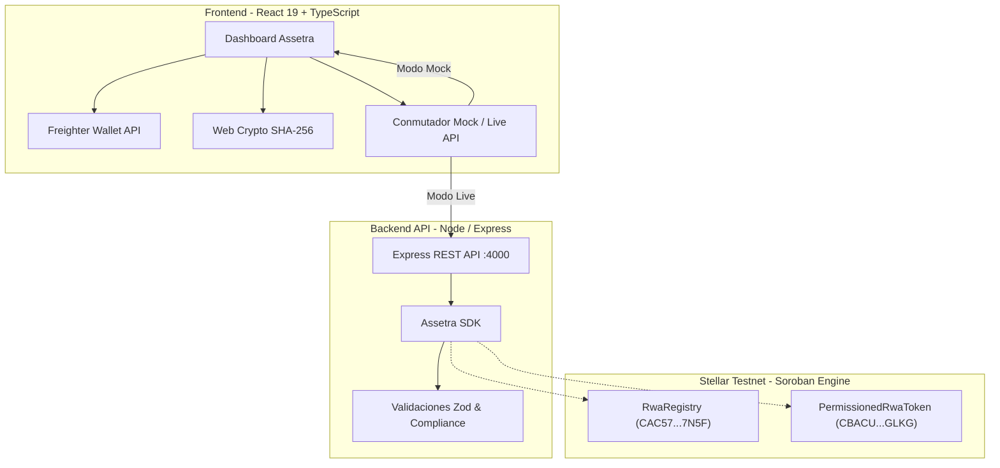

# Assetra — Infraestructura RWA sobre Stellar

> **Infraestructura modular para registrar, emitir y administrar activos del mundo real (RWA) con cumplimiento normativo y reglas verificables on-chain sobre Stellar Testnet.**

[](https://stellar.expert/explorer/testnet)
[](https://soroban.stellar.org/)
[](https://react.dev/)
[]()

---

## 1. Visión General

Assetra resuelve el desafío de emitir activos del mundo real (como facturas comerciales, pagarés o bienes raíces) en blockchain cumpliendo estrictamente con la normativa financiera:
- **Respaldo Inmutable**: Cada activo registra su custodia legal y la huella criptográfica SHA-256 de sus contratos y facturas en el registro descentralizado.
- **Tokens Permissioned**: Ningún token RWA puede ser transferido a una cuenta que no haya sido expresamente autorizada por el Oficial de Compliance de la plataforma.
- **Control Cautelar**: Posibilidad de inmovilizar (congelar) cautelarmente cuentas bajo investigación judicial o sospecha de fraude sin alterar el estado del activo subyacente.
- **Modo Híbrido Mock-First**: Arquitectura desacoplada que permite operar de forma 100% autónoma en navegador o conectarse en vivo a la API y a los contratos Soroban.

---

## 2. Contratos Desplegados en Stellar Testnet

Los contratos inteligentes se encuentran desplegados, inicializados y verificados en **Stellar Testnet**:

| Contrato | Contract ID | Explorador Público |
|---|---|---|
| **RwaRegistry** | `CAC57CATCF5DZYLRW6XEZ4DP367V25D24KO6V37U4EEQWJO3CTVV7N5F` | [Ver en Stellar Expert](https://stellar.expert/explorer/testnet/contract/CAC57CATCF5DZYLRW6XEZ4DP367V25D24KO6V37U4EEQWJO3CTVV7N5F) |
| **PermissionedRwaToken** | `CBACUWCFDNO7BU7UCI7G4U45Y5WDNXCAGVI4AFQO5ZBMBHMRFC67GLKG` | [Ver en Stellar Expert](https://stellar.expert/explorer/testnet/contract/CBACUWCFDNO7BU7UCI7G4U45Y5WDNXCAGVI4AFQO5ZBMBHMRFC67GLKG) |

### Cuentas del Sistema en Testnet:
- **Admin**: `GB72W3C6VBQ7OU3VRJLDATVKXDSF6OUNS2NXZPIZ22BYUDZBXLBMBOI4`
- **Emisor**: `GDKMHSGEQBJ7OUSQWA4TA2YHH2EQIQ4YE2RV2RMUZEW5NXIVPLCBLTKJ`
- **Oficial de Compliance**: `GBRLOUSTR76GIMHAMQGKLO4EBJEALCB5R2OVZ4RQGOGV7LNCIBNTALAX`
- **Inversor A (Autorizado)**: `GCRVRGTER4FV3VPIO6C4TIG63OZNXMOCQCZR5LUBFB4OUB53FBOKBGLO`
- **Inversor B (No Autorizado)**: `GAYKF4XDJV4EE57XKTYKWF5AYWBET34OQXVO7GIOZW2CFPKPUKIDKQOL`

Los parámetros de integración se encuentran documentados en [`contracts.json`](./contracts.json) y en el [`contracts/README.md`](./contracts/README.md).

---

## 3. Arquitectura del Sistema



---

## 4. Guion Completo de Demostración

Para ver el paso a paso detallado de la presentación, revisa el **[Guion Oficial de Demostración (DEMO_SCRIPT.md)](./DEMO_SCRIPT.md)**, el cual cubre:
1. **Flujo Ideal (*Happy Path*)**: Conexión Freighter, registro de activo, cálculo de huella SHA-256 en navegador, autorización de participante, emisión y transferencia con confirmación en Stellar Expert.
2. **Catálogo de Casos de Fallo & Reglas de Compliance**:
   - Transferencia a cuenta desconocida (`ReceiverNotAuthorized`).
   - Transferencia a cuenta con KYC pendiente.
   - Transferencia a cuenta congelada cautelarmente.
   - Transferencia originada por cuenta congelada (`WalletFrozen`).
   - Transferencia originada por cuenta revocada (`SenderNotAuthorized`).
   - Bloqueo de emisión en activo pausado (`AssetNotActive`).
   - Protección contra emisión mayor al suministro máximo.
   - Detección de adulteración documental por discrepancia de hash SHA-256.
   - Control de acceso de firmas (`require_auth` del Oficial de Compliance).

---

## 5. Inicio Rápido

### Prerrequisitos
- Node.js v20+ o v24+
- npm v10+

### Instalación
```bash
# Clonar e instalar todas las dependencias
npm install
```

### Ejecutar Entorno de Desarrollo (Fullstack)
```bash
npm run dev
```
Inicia concurrentemente:
- **Frontend**: [http://localhost:5173](http://localhost:5173)
- **Backend API**: [http://localhost:4000](http://localhost:4000) (Endpoints `/health`, `/api/assets`, `/api/assets/:id/transfers`)

---

## 6. Comandos Disponibles

| Comando | Descripción |
|---|---|
| `npm run dev` | Inicia frontend y backend simultáneamente en modo desarrollo |
| `npm run build` | Compila frontend y backend para producción |
| `npm run test` | Ejecuta las 14 pruebas unitarias y de integración (Vitest) |
| `npm run typecheck` | Valida tipos en TypeScript de todos los espacios de trabajo |
| `npm run script:deploy` | Compila y despliega contratos Soroban a Stellar Testnet |
| `npm run script:seed` | Inicializa el activo y las cuentas de prueba en Testnet |
| `npm run script:demo` | Ejecuta la demostración on-chain automatizada en Testnet |

---

## 7. Estructura del Repositorio

```text
├── contracts/               # Contratos inteligentes en Rust (Soroban)
│   ├── rwa_registry/        # Registro de activos y hashes documentales
│   ├── rwa_token/           # Token permissioned con reglas de compliance
│   └── README.md            # Guía detallada de contratos y tests Rust
├── frontend/                # Aplicación Web React 19 + TypeScript + Vite
│   ├── src/lib/             # Clientes Assetra (Mock, HTTP y Switcher)
│   ├── src/components/      # Componentes UI (OrbitalLines, etc.)
│   └── src/App.tsx          # Dashboard, panel de transferencias y compliance
├── backend/                 # API REST Express + TypeScript
│   ├── src/app.ts           # Rutas y validaciones Zod
│   ├── src/sdk/             # SDK de Assetra y adaptadores
│   └── tests/               # Pruebas automatizadas con Supertest + Vitest
├── scripts/                 # Scripts CLI de despliegue y demo on-chain
│   ├── deploy.ts            # Despliegue en Stellar Testnet
│   ├── seed.ts              # Inicialización y fondeo de cuentas
│   └── demo.ts              # Demostración on-chain de casos de éxito y fallo
├── contracts.json           # Direcciones y contratos desplegados en Testnet
├── DEMO_SCRIPT.md           # Guion de demostración y catálogo de casos de fallo
└── README.md                # Documentación principal
```
